<!--
  Profile README for github.com/furyydev/furyydev
  Generated from the animated-profile template. The portrait (370) and info
  card (490) sit in a table so they render at the same height. The contribution
  graph refreshes daily via .github/workflows/update-profile-art.yml.
-->

<table>
<tr>
<td valign="top"></td>
<td valign="top"></td>
</tr>
</table>

## Satvik Shrivastava

**Software Developer | Video Editor**

 

<!-- animated contribution graph, refreshed daily by the workflow -->

